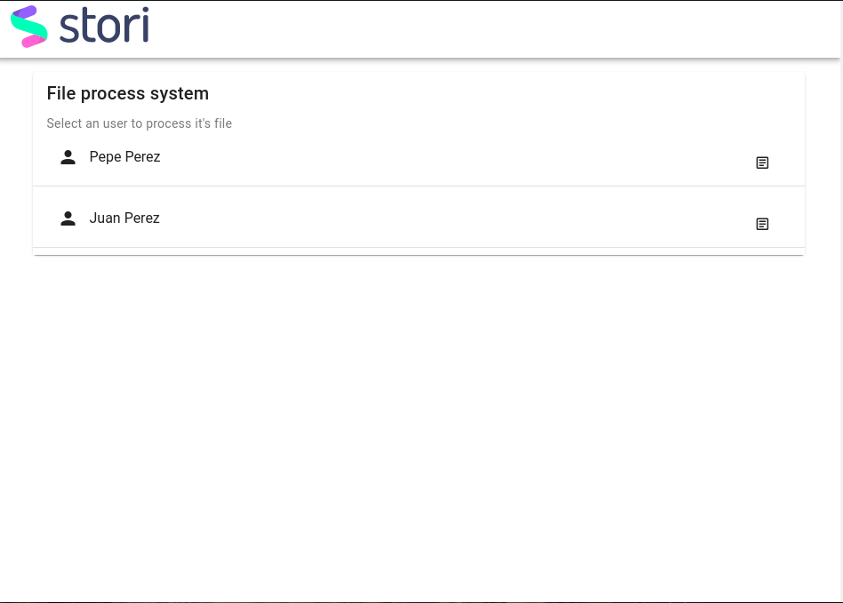
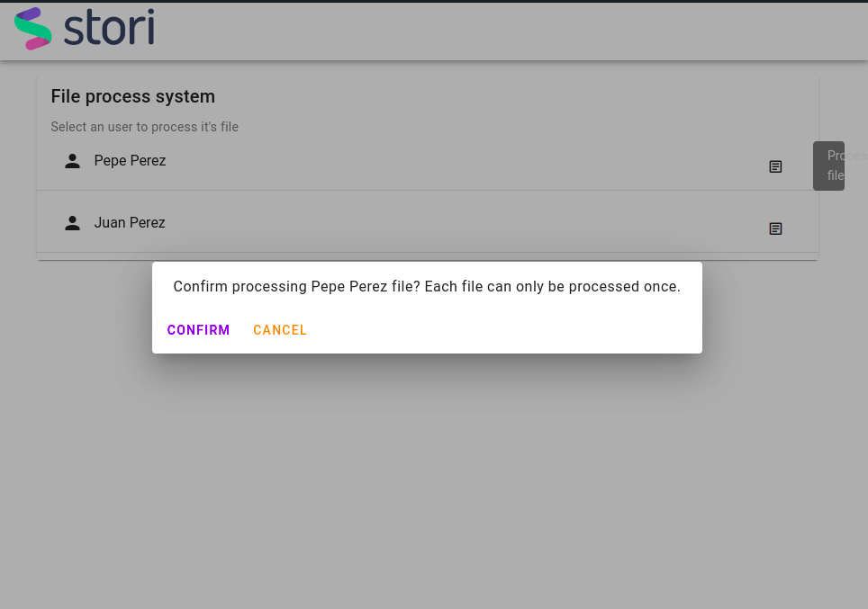
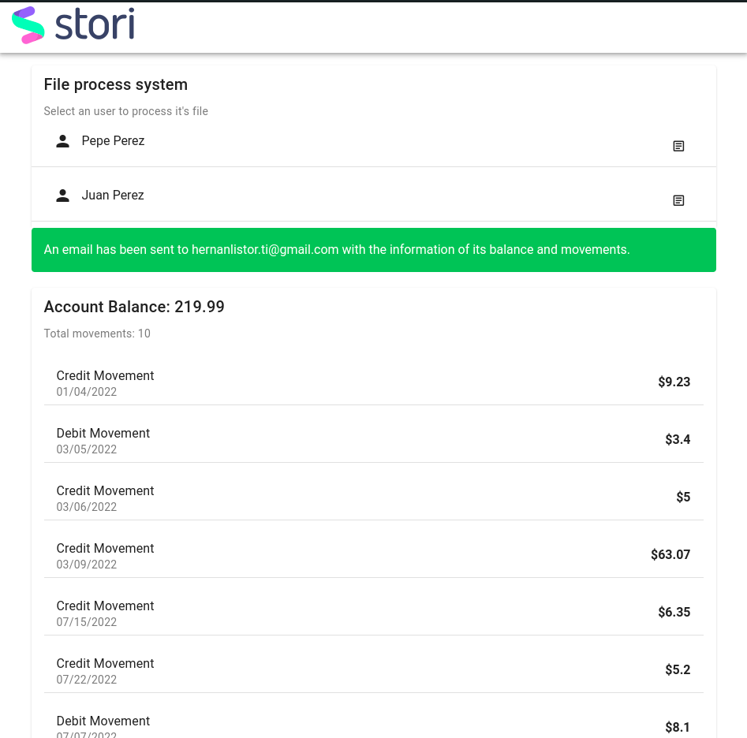
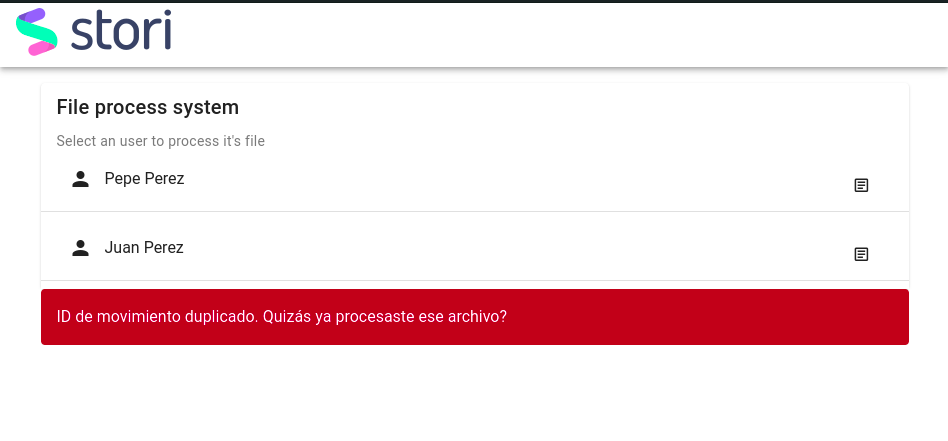

# Stori project frontend
This is the frontend for the stori code challenge.

## Stack
This project uses:
- [Vue 3](https://vuejs.org/)
- [Vuetify](https://next.vuetifyjs.com/en/)
- [Vite](https://vitejs.dev/)


## How to run it 
First set the API server in the .env file

Install the dependencies:
```
yarn
```

Run as dev:
```
yarn dev
```

Build for production:
```
yarn build
```

## Screenshots






